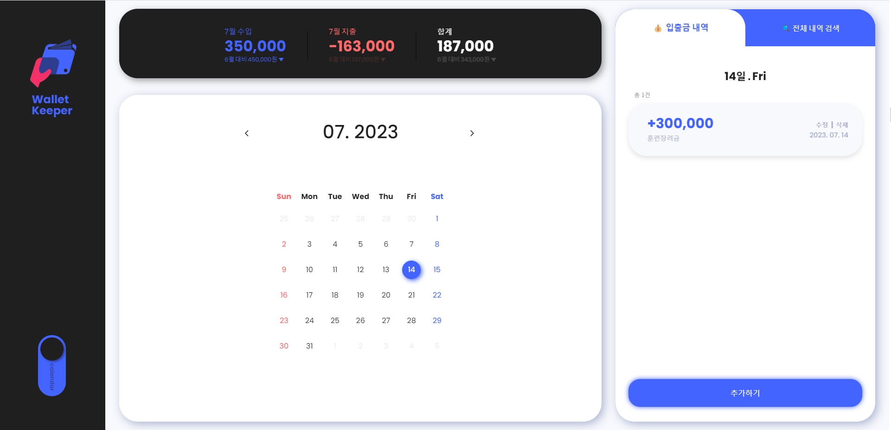
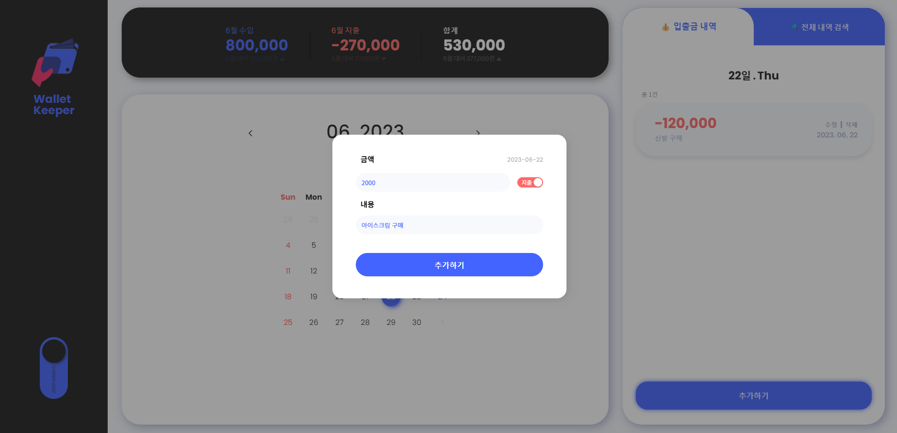
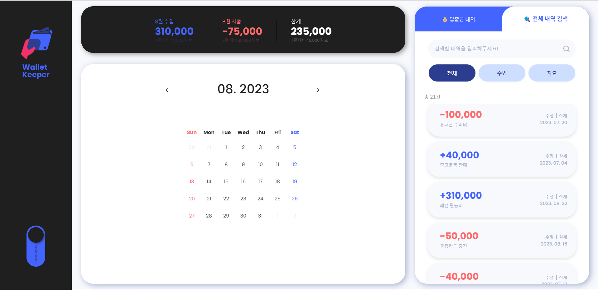
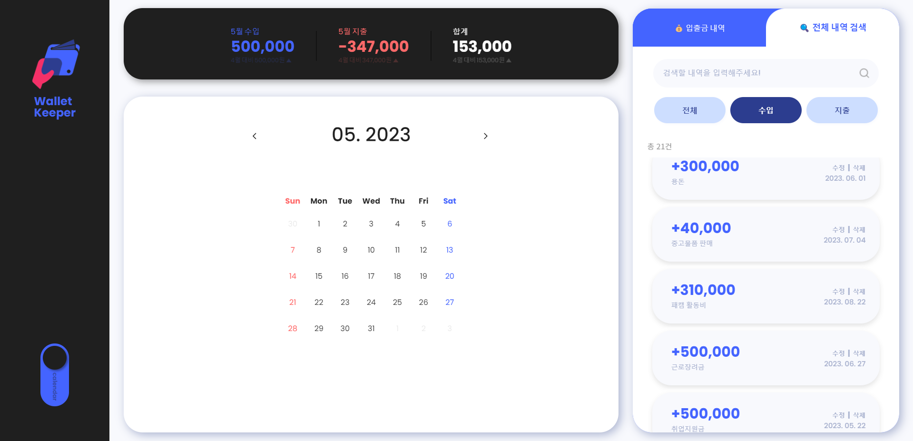
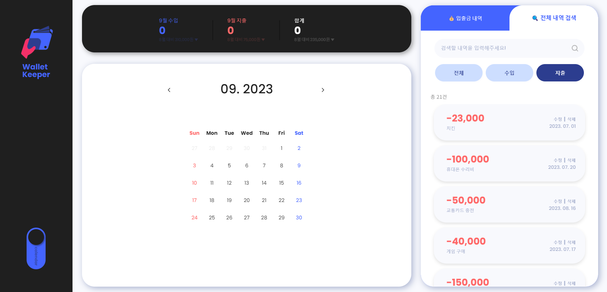
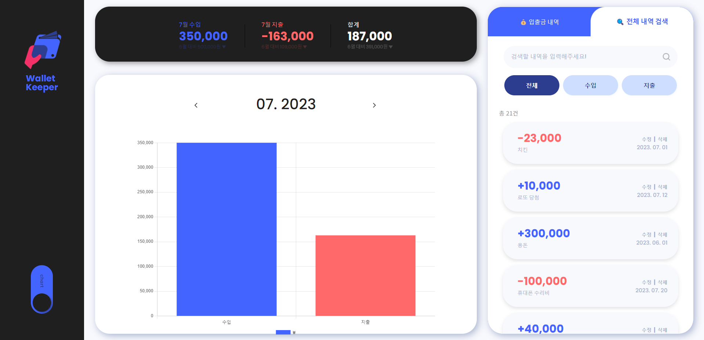

#  Wallet Keeper

# 배포사이트

   

# 개발팀원

<table>
  <tr>
    <td align="center">
      <a href="https://github.com/cdm1263">
         
        <b>차동민</b> 
      </a>
    </td>
    <td align="center">
      <a href="https://github.com/kse-seong-eun">
         
        <b>김성은</b> 
      </a>
    </td>
    <td align="center">
      <a href="https://github.com/saeyeonKim">
         
        <b>김세연</b> 
      </a>
    </td>
     <td align="center">
      <a href="https://github.com/jinyoungpark231">
         
        <b>박진영</b> 
      </a>
    </td>
  </tr>
 <tr>
    <td align="center">
        <b>역할</b> 작성용 모달 구현,캘린더 구현, 깃허브 및 브랜치 관리
    </td>
    <td align="center">
       <b>역할</b> 차트 구현, 디자인 구현
    </td>
    <td align="center">
     <b>역할</b> 날짜별 조회,수정 삭제,검색기능 구현         
    </td>
     <td align="center">
        <b>역할</b> 날짜별 수입,지출,합계 구현 
    </td>
  </tr>

</table>

---

  

# 프로젝트기간

2023.07.05 ~ 2023.07.14

 
 

 
 

# 기술스택

### Develoment

 

  
  
  
     
  
  
  

### Config

### Enviroment

 

### Cowork Tools

## 전체 화면 구성

|                      **메인 페이지**                      |                          **수입 추가**                          |
| :-------------------------------------------------------: | :-------------------------------------------------------------: |
|  |  |

|                           **지출 추가**                           |                        **전체 내역 검색(전체)**                         |
| :---------------------------------------------------------------: | :---------------------------------------------------------------------: |
|  |  |

|                      **전체 내역 검색(수입)**                       |                      **전체 내역 검색(지출)**                       |
| :-----------------------------------------------------------------: | :-----------------------------------------------------------------: |
|  |  |

**차트 부분**  

  
