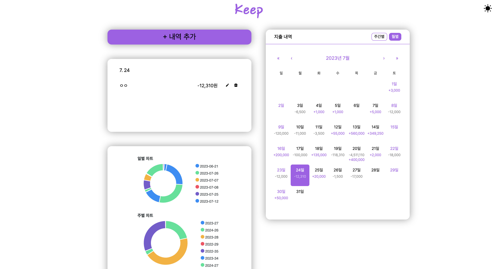
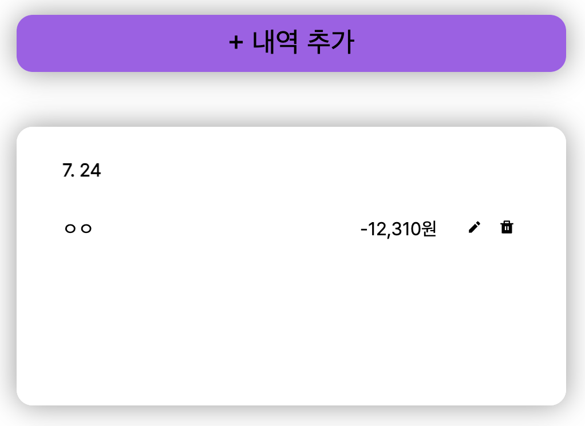
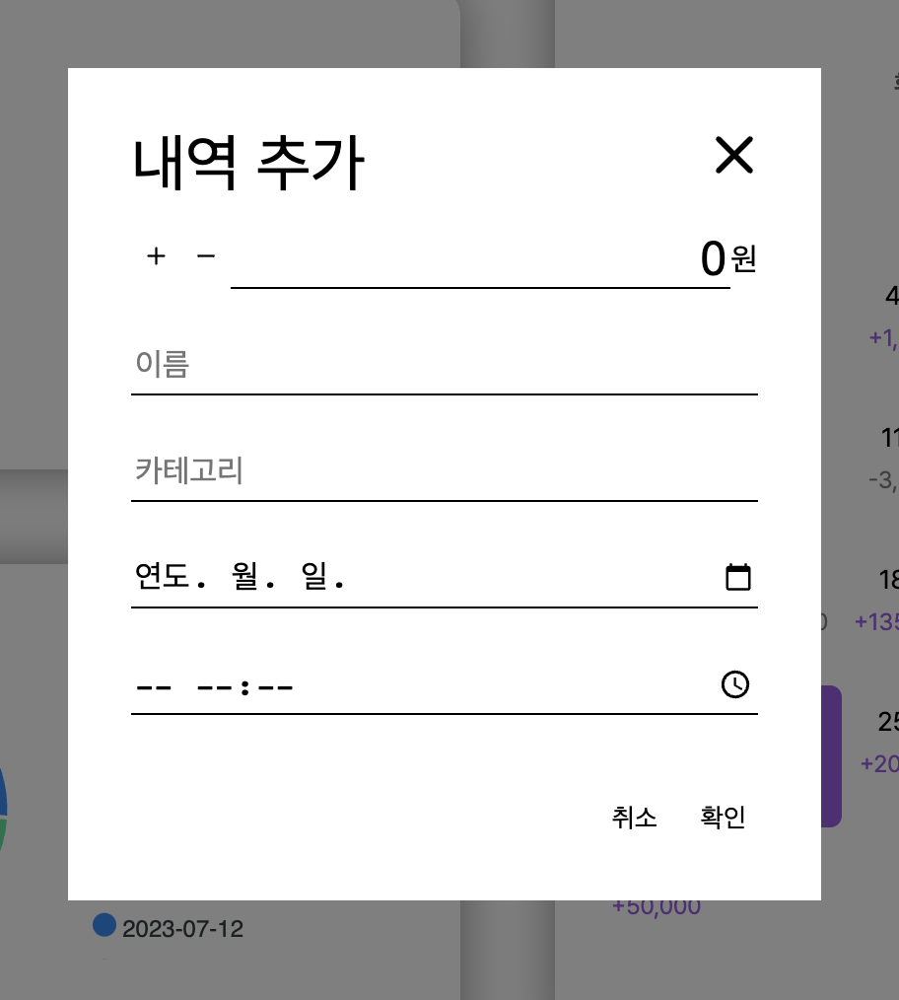
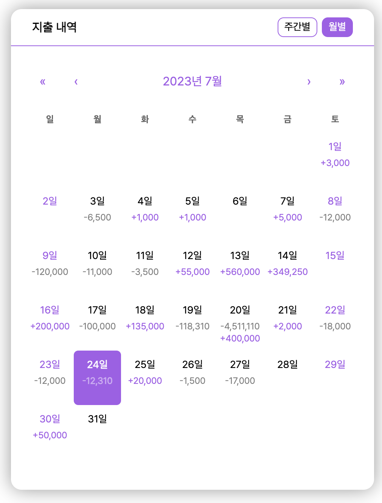
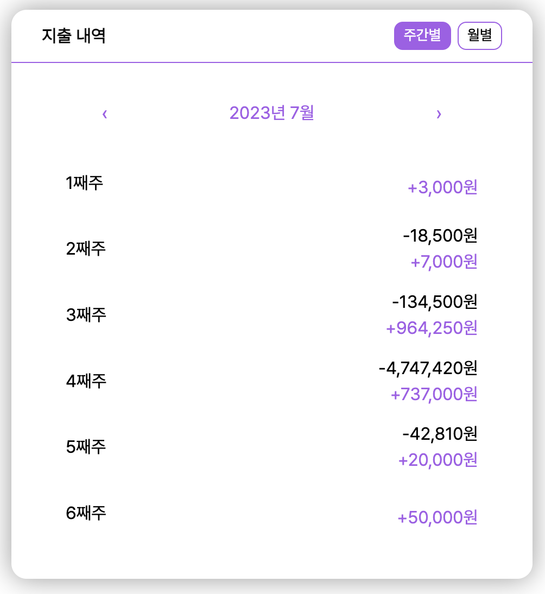
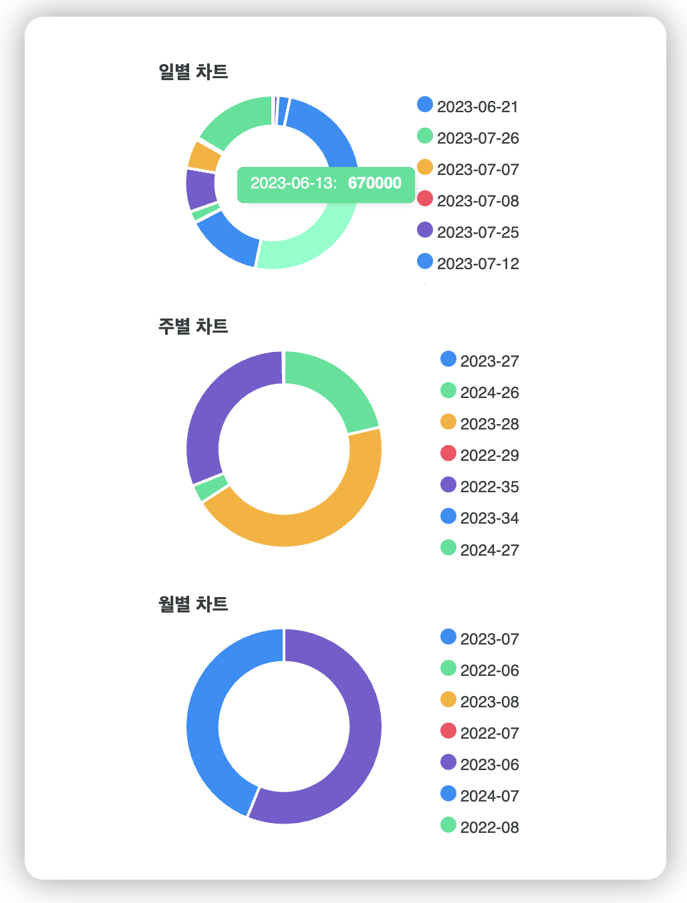
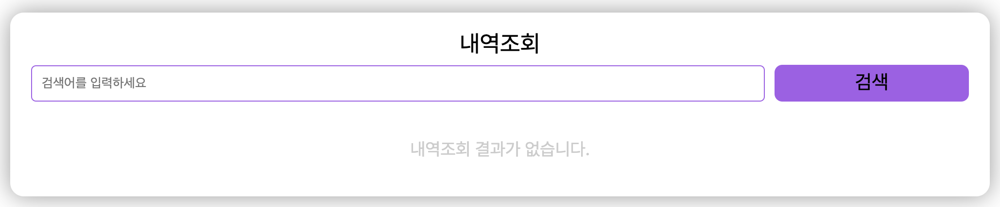
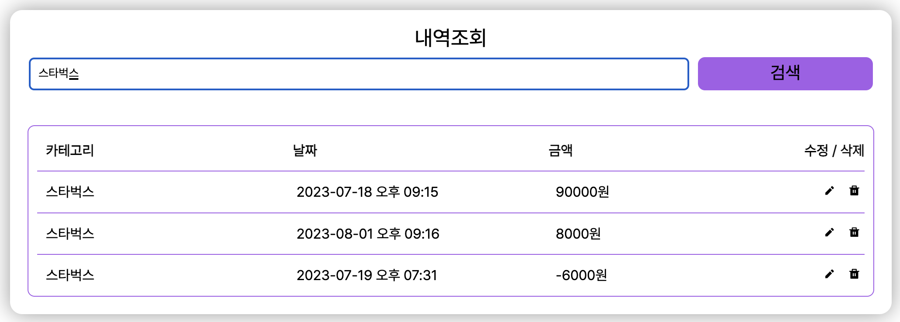

# KEEP
링크 [클릭](https://keep-team1.netlify.app)
github [클릭](https://github.com/pildrums/KDT5-M6/tree/KDT5_Team1)

# 👩‍🚀 개발팀

<table>
  <tr>
    <td align="center">
      <a href="https://github.com/pildrums">
         
        <b>김필진</b> 
      </a>
    </td>
    <td align="center">
      <a href="https://github.com/Eunjii">
         
        <b>이은지</b> 
      </a>
    </td>
    <td align="center">
      <a href="https://github.com/doitidey">
         
        <b>임승이</b> 
      </a>
    </td>
     <td align="center">
      <a href="https://github.com/cdm1263">
         
        <b>방미선</b> 
      </a>
    </td>
  </tr>
 <tr>
    <td align="center">
        <b>소비내역 월별 차트</b> 
    </td>
    <td align="center">
        <b>소비내역 추가, 수정, 삭제 모달, 메인화면 레이아웃</b> 
    </td>
    <td align="center">
        <b>소비내역 일별, 주간, 월별 캘린더</b> 
    </td>
     <td align="center">
        <b>소비내역 검색, 조회</b> 
    </td>
  </tr>

</table>

 
 

# 사용기술 및 개발환경

### Development

 
 

# 화면 구성
## 1. 전체화면 (담당 조원: 총원)

## 2. 내역 추가 (담당 조원: 이은지)

## 3. 월별/주간 지출 내역 (담당 조원: 임승이)

## 4. 지출 내역 차트 (담당 조원: 김필진)

## 6. 내역 조회 (담당 조원: 방미선)

