## 📌프로젝트 소개

### 📊 가계구조대(SAVEWALLET)

REST API를 활용한 가계부 프로젝트로 수입과 지출을 기록,수정,삭제 할 수 있고 수입, 지출 내역을 리스트와 달력, 차트로 확인할 수 있는 반응형 웹입니다.

### 프로젝트 기간

2023년 7월 5일 ~ 2023년 7월 24일

## 📌개발팀원 및 역할

| <a href="https://github.com/hookor"></a> | <a href="https://github.com/7581058"></a> | <a href="https://github.com/DevYBecca"></a> | <a href="https://github.com/leechanghwi"></a> |
| :----------------------------------------------------------------------------------------------------------------------------------: | :-----------------------------------------------------------------------------------------------------------------------------------: | :-------------------------------------------------------------------------------------------------------------------------------------: | :---------------------------------------------------------------------------------------------------------------------------------------: |
|                                                 [안중후](https://github.com/hookor)                                                  |                                                 [김다슬](https://github.com/7581058)                                                  |                                                 [윤금엽](https://github.com/DevYBecca)                                                  |                                                 [이창휘](https://github.com/leechanghwi)                                                  |
|                                                          캘린더 페이지 구현                                                          |                                                        메인, 추가 페이지 구현                                                         |                                                            차트 페이지 구현                                                             |                                                            리스트 페이지 구현                                                             |

## 📌배포사이트

[SAVEWALLET](https://savewallet.netlify.app/)

## 📌Stack

Config  


Development  


Library  

 

Enviroment  


Deployment  


Cowork Tools  
  

## 📌구현 페이지와 주요 기능

**1️⃣ 메인페이지**

- 현재 로그인 중인 사용자의 이번 달 수입/지출 합계 조회
- 현재 로그인 중인 사용자의 오늘 수입/지출 합계 조회
- 지출 내역, 달력, 차트, 수입/지출 입력 페이지로 이동
- 메뉴 슬라이드에서 로그인 클릭 시 로그인 페이지로 이동
- 메뉴 슬라이드에서 로그아웃 클릭 시 로그아웃

**2️⃣ 수입/지출 입력페이지**

- 기록할 수입/지출 선택
- 기록할 금액 입력
- 기록할 사용처(메모) 입력
- 기록할 날짜, 시간 선택
- 저장 버튼을 통한 기록 추가

**3️⃣ 지출내역 페이지**

- 기록한 내역 월별 조회
- 기록한 날짜, 기록한 카테고리, 사용처 조회
- 기록한 날의 총 수입, 총 지출, 수입/지출 합계 조회
- 모달을 통한 기록 수정
- 내역 삭제
- 달력, 차트, 입력 페이지로 이동

**4️⃣ 달력 페이지**

- 기록한 내역 월별 달력으로 조회
- 내역 클릭 시 날짜별 작성된 수입/지출 금액 조회
- 내역 클릭 시 날짜별 작성된 수입/지출 카테고리
- 내역 클릭 시 날짜별 작성된 수입/지출 사용처 조회
- 내역, 차트, 입력 페이지로 이동

**5️⃣ 차트 페이지**

- 기록된 내역 월에 따른 카테고리별 수입/지출 차트로 조회
- 기록된 내역 월 별 수입/지출 총액 조회
- 기록된 카테고리 리스트 출력
- 카테고리별 수입/지출 총액 출력
- 각 카테고리 클릭 시 카테고리별 월별 서브차트 조회로 이동  
  → 기록된 내역이 없는 월로 이동시 입력 페이지로 이동할 수 있도록 알림

**6️⃣ 서브차트 페이지**

- 기록한 내역 카테고리별, 월별 수입/지출 총액 차트로 조회
- 기록한 내역 카테고리별 전체 조회
- 내역, 달력, 입력 페이지로 이동

**7️⃣ 로그인 페이지**

- 카카오 로그인 API를 통한 로그인
- 메인 페이지로 돌아가기

## 📌폴더 구조

<details>
<summary>보기</summary>
<div markdown="1">

```
📦
├─ .eslintrc.cjs
├─ .gitignore
├─ .prettierrc
├─ README.md
├─ index.html
├─ netlify.toml
├─ package-lock.json
├─ package.json
├─ public
│  └─ favicon.ico
├─ src
│  ├─ api
│  │  ├─ DeleteList.ts
│  │  ├─ EditList.ts
│  │  ├─ ExpensesSummary.ts
│  │  ├─ FetchCategoryExpenses.ts
│  │  ├─ LogAccount.ts
│  │  ├─ LogExpense.ts
│  │  ├─ MonthlyExpenses.ts
│  │  ├─ axios.ts
│  │  └─ index.ts
│  ├─ assets
│  │  ├─ kakao_login_medium_wide.png
│  │  └─ logo_gradi.png
│  ├─ components
│  │  ├─ App.tsx
│  │  ├─ chart
│  │  │  ├─ ChartList.tsx
│  │  │  ├─ IncomeExpensesFilter.tsx
│  │  │  ├─ PeriodRange.tsx
│  │  │  └─ PieChartOptions.ts
│  │  ├─ common
│  │  │  ├─ DeleteItem.tsx
│  │  │  ├─ EditModal.tsx
│  │  │  ├─ ErrorComponent.tsx
│  │  │  ├─ Footer.tsx
│  │  │  ├─ Header.tsx
│  │  │  ├─ Loading.tsx
│  │  │  ├─ Month.tsx
│  │  │  ├─ NotFound.tsx
│  │  │  ├─ ViewLogs.tsx
│  │  │  └─ index.ts
│  │  ├─ home
│  │  │  └─ SlideMenu.tsx
│  │  ├─ index.ts
│  │  ├─ list
│  │  │  └─ ListItems.tsx
│  │  └─ subchart
│  │     ├─ BarChartOptions.ts
│  │     └─ ChartList.tsx
│  ├─ hooks
│  │  ├─ ChartHooks.ts
│  │  └─ index.ts
│  ├─ main.tsx
│  ├─ pages
│  │  ├─ Calendar.tsx
│  │  ├─ Chart.tsx
│  │  ├─ Home.tsx
│  │  ├─ KakaoLogin.tsx
│  │  ├─ List.tsx
│  │  ├─ LogAccount.tsx
│  │  ├─ Router.tsx
│  │  ├─ SignIn.tsx
│  │  ├─ SubChart.tsx
│  │  └─ index.ts
│  ├─ recoil
│  │  ├─ DateState.ts
│  │  ├─ SelectedCategoryState.ts
│  │  ├─ SelectedDateState.ts
│  │  └─ index.ts
│  ├─ style
│  │  ├─ fonts
│  │  │  └─ global.ts
│  │  ├─ index.ts
│  │  └─ theme.ts
│  ├─ types
│  │  ├─ chart-types.d.ts
│  │  ├─ font.d.ts
│  │  ├─ fonts.d.ts
│  │  └─ subchart-types.d.ts
│  └─ vite-env.d.ts
├─ tsconfig.json
├─ tsconfig.node.json
└─ vite.config.ts
```

</div>
</details>

## 📌구현 화면

| 메인페이지(모바일)                            | 메인페이지(데스크탑)                           |
| --------------------------------------------- | ---------------------------------------------- |
| 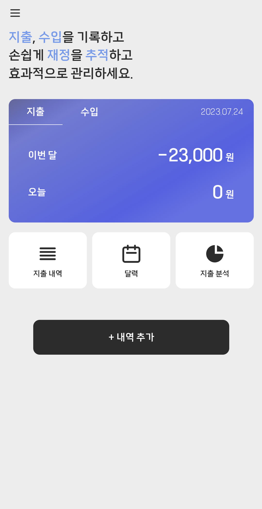 | 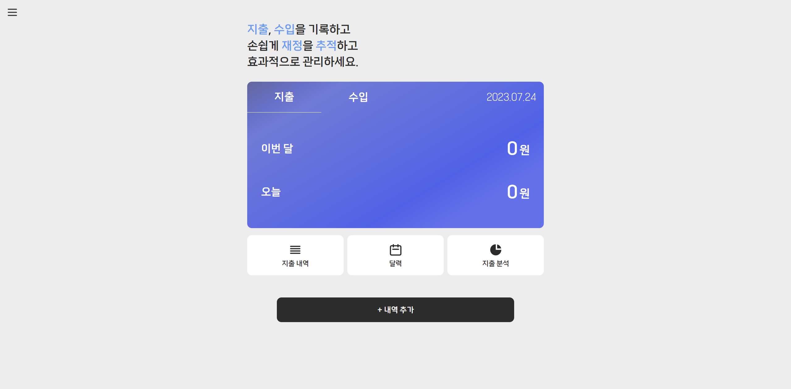 |

| 지출/소비 입력 페이지(모바일)                       | 지출/소비 입력 페이지(데스크탑)                             |
| --------------------------------------------------- | ----------------------------------------------------------- |
| 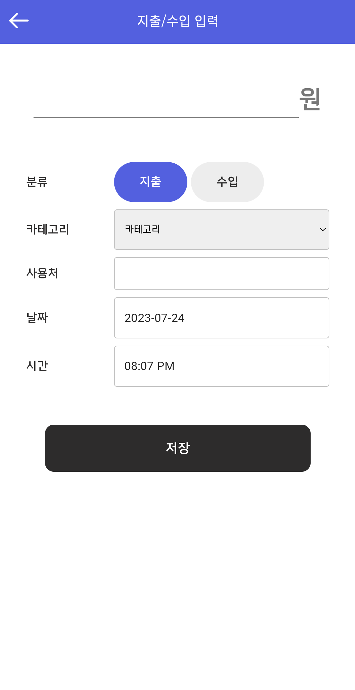 | 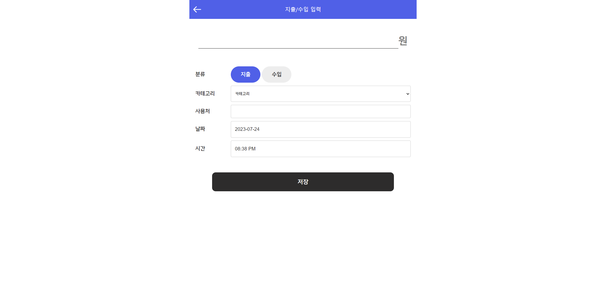 |

| 지출/소비 내역 페이지(모바일)                 | 지출/소비 내역 페이지(데스크탑)                       |
| --------------------------------------------- | ----------------------------------------------------- |
| 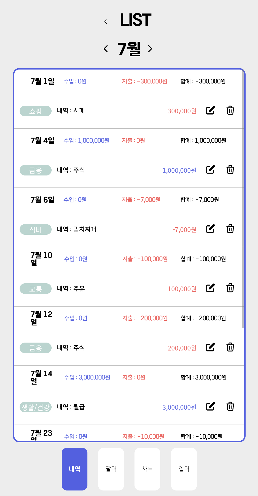 | 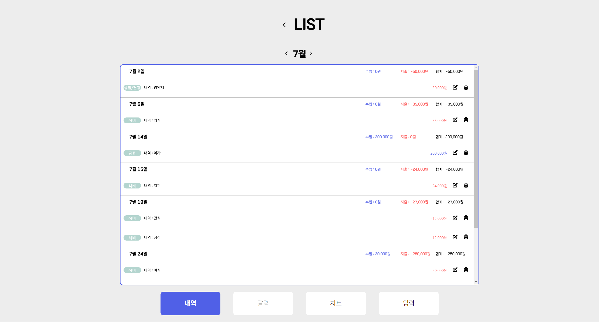 |

| 달력 페이지(모바일)                               | 달력 페이지(데스크탑)                                     |
| ------------------------------------------------- | --------------------------------------------------------- |
| 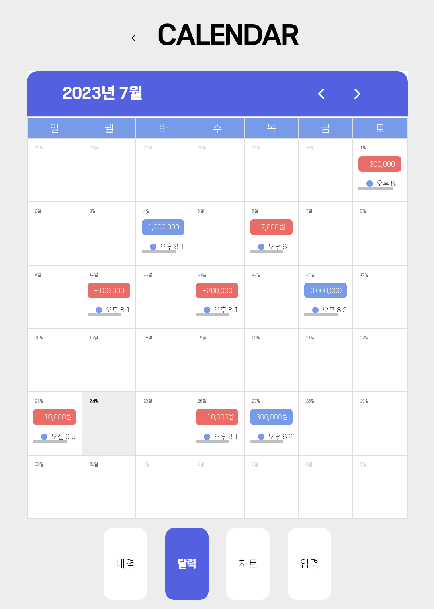 | 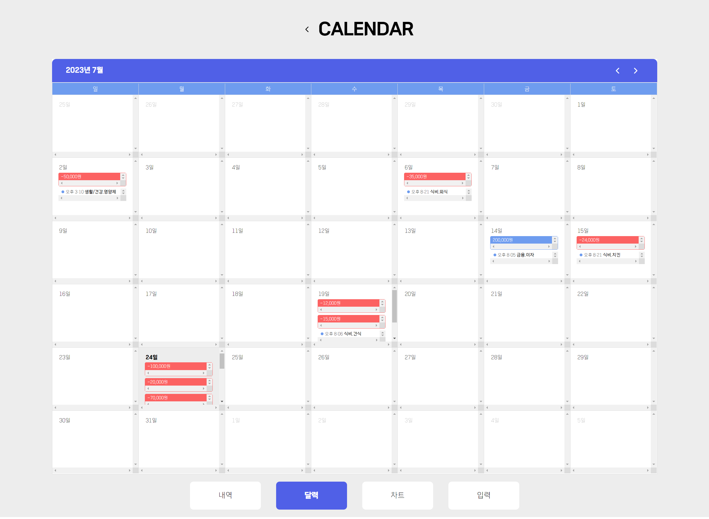 |

| 차트 페이지(모바일)                            | 차트 페이지(데스크탑)                                  |
| ---------------------------------------------- | ------------------------------------------------------ |
| 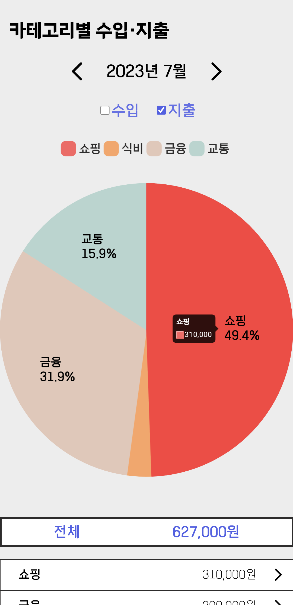 | 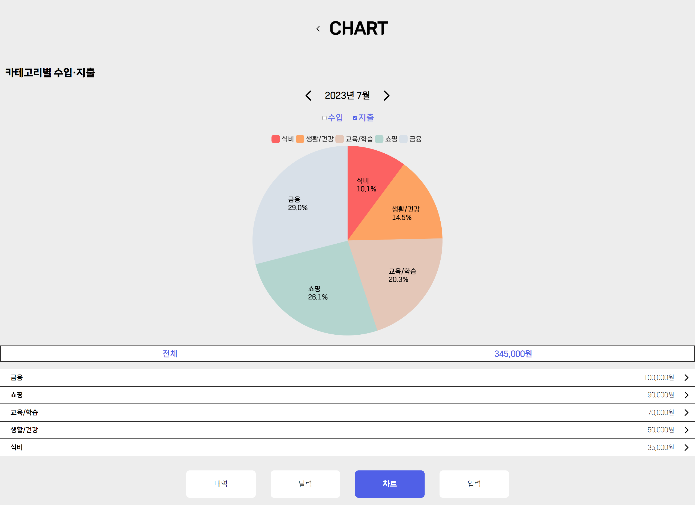 |

| 서브차트 페이지(모바일)                           | 서브차트 페이지(데스크탑)                                 |
| ------------------------------------------------- | --------------------------------------------------------- |
| 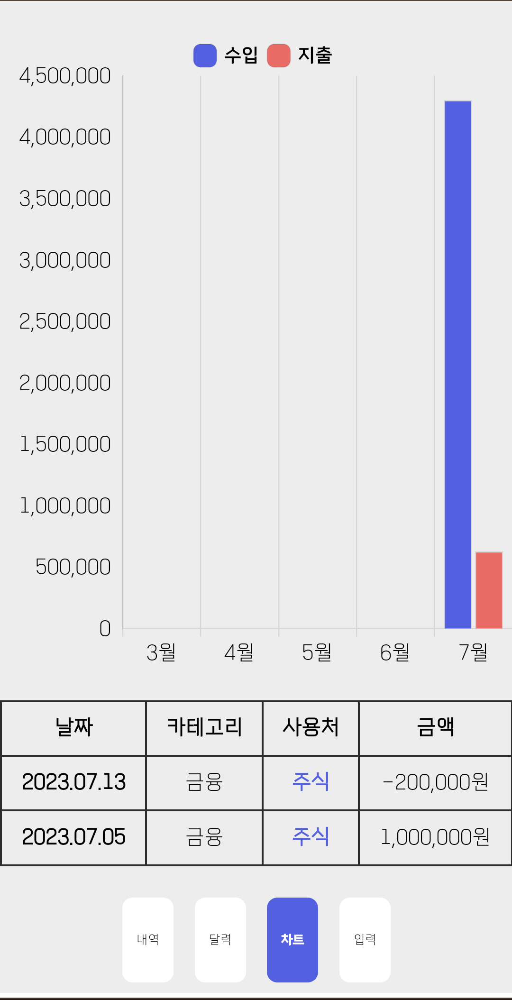 | 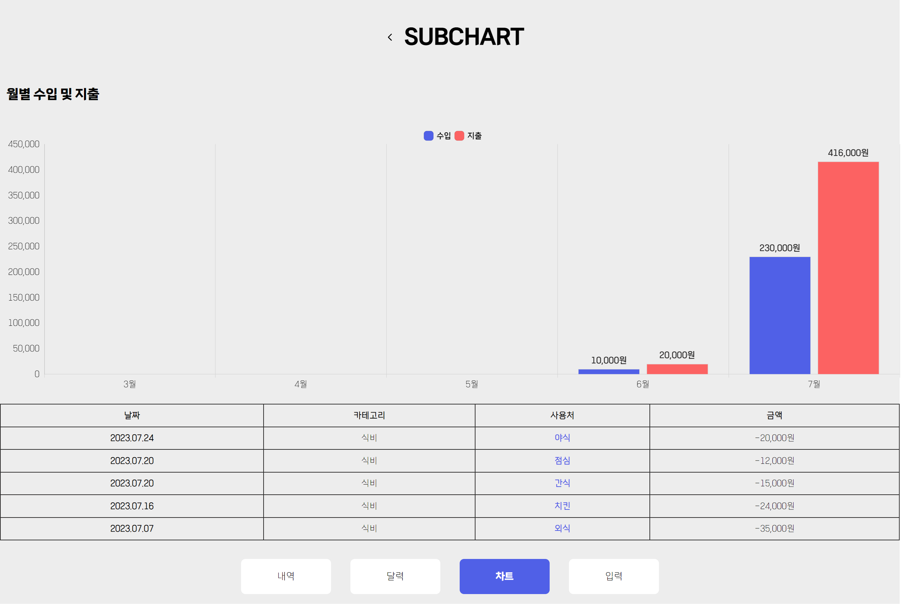 |
